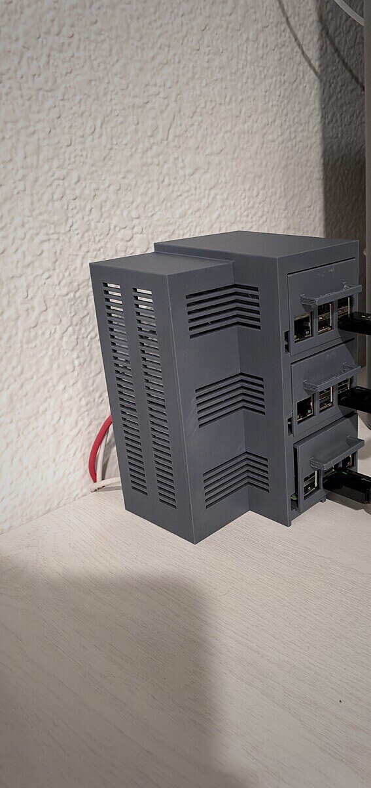
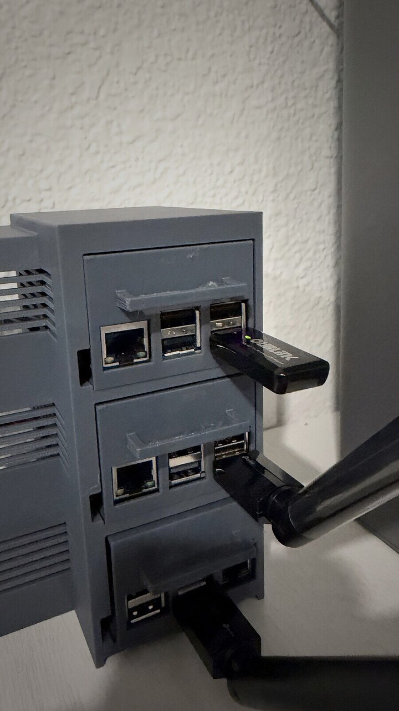
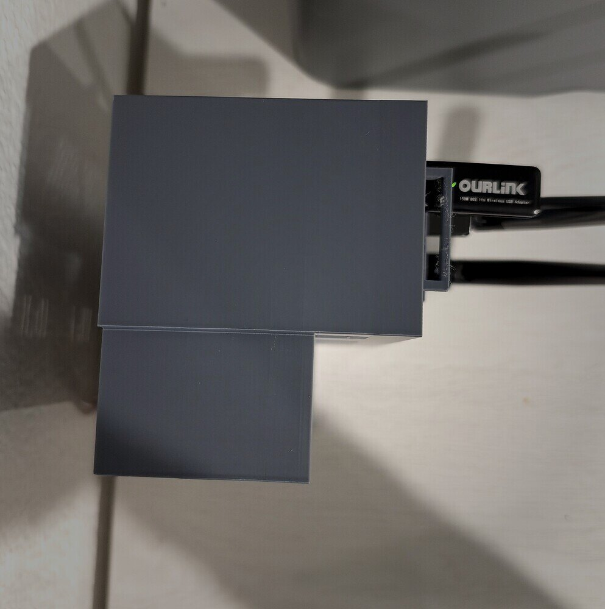

# raspberry-pi-fun

Local model development for a Raspberry Pi fleet. pi-pair chat is a stdlib Python router. It proxies OpenAI-style chat to Ollama or llama.cpp on pi2, pi3, and pi4.

No pip packages. It listens on **18080**.

## Hardware

pi2, pi3, and pi4 all sit in one custom 3D-printed server rack. Tailscale names are rpi-pi2, rpi-pi3, and rpi-pi4.







## Layout

```
pi-pair/
  mini_chat.py          start here
  start.sh              same command
  pair/                 peers, health, chat, stream, HTTP
  static/               chat HTML, CSS, JS
  peers.example.json    fleet map (copy to peers.json)
  install.sh            copy to ~/pi-pair and write a user systemd unit
  mesh-hello.sh         curl /health, probe peers, send one chat
  test_pair.py          stdlib unittest
  docs/rack/            photos of the 3D-printed rack
  README.md             endpoints, fleet map, environment
```

`peers.json` is gitignored. `install.sh` creates it from the example only when the Pi does not already have one.

## Start

From a checkout, or from `~/pi-pair` after install:

```bash
cd pi-pair
python3 mini_chat.py
```

`bash start.sh` is the same command. Default bind is `0.0.0.0:18080`.

Smoke without a model process (peers show down; that is fine):

```bash
python3 mini_chat.py
# another shell
curl -sS http://127.0.0.1:18080/health
```

Tests:

```bash
python3 -m unittest discover -s pi-pair -p 'test_*.py'
```

With the fleet up:

```bash
bash pi-pair/mesh-hello.sh
```

## Install on a Pi

```bash
rsync -av pi-pair/ pi3:~/pi-pair/
ssh pi3
cd ~/pi-pair
bash install.sh
# edit LAN hosts if needed, then:
systemctl --user daemon-reload
systemctl --user enable --now pi-pair.service
```

The example fleet, endpoints, and environment variables are in `pi-pair/README.md`.
