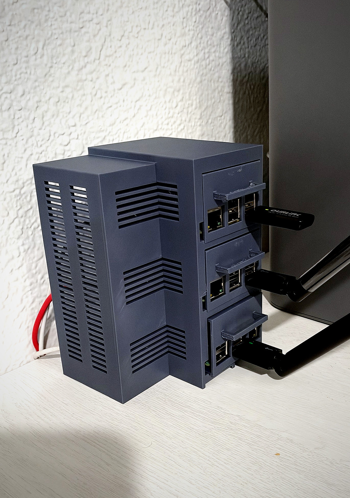
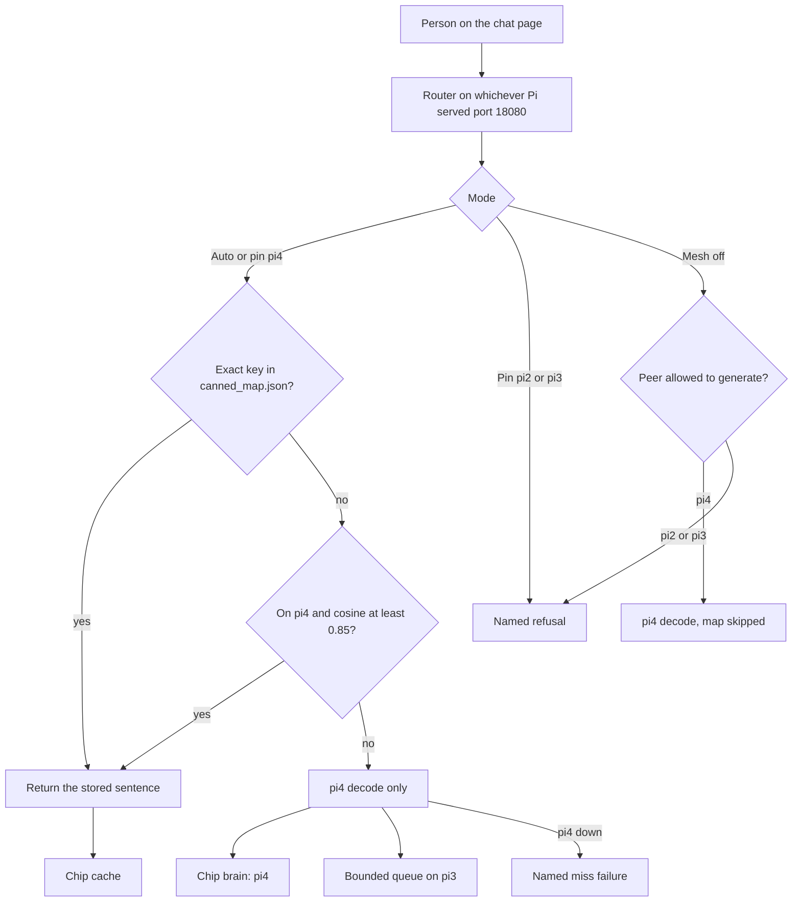
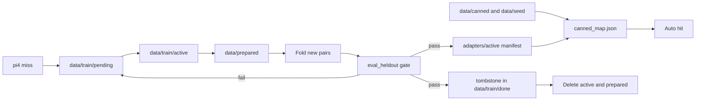

# pi-pair

Chat router for the pi2, pi3, and pi4 fleet. Stdlib Python only (no pip). It listens on **18080**. A known line is answered from the canned map. On pi4, a paraphrase of a known line is answered from that same map when its cosine is at least 0.85. Anything the map does not contain is generated on pi4 and only on pi4.

The local model is small. Search and the canned map are how it answers facts it does not know.

This tree is the software half of that loop. [PR #23](https://github.com/akashnaren/raspberry-pi-fun/pull/23) merged on 2026-10-02 (`45050ee`). After that deploy of main, live end-to-end stages 1–5 on the boards were GREEN. Product Ship was YES the same day, about 13:40 PT. The prove packet for that run is the post-#23 board record at `45050ee` (fleet handoff; not a file in this tree). Hugging Face holds datasets only so far; this document does not claim published model weights.

## Hardware

pi2, pi3, and pi4 all sit in one custom 3D-printed server rack. Tailscale names are rpi-pi2, rpi-pi3, and rpi-pi4.




## What local inference means here

A reply is local when the tokens, or the stored sentence that stands in for them, are produced on this rack. The phone opens a page on a Pi. The router on that Pi decides. Either it reads a sentence that was already written down, or it asks pi4 to run one forward pass of a small language model and stream the tokens back. The phone does not call a hosted chat API for this path, and a miss is not an excuse to borrow a model from a weaker board.

The mesh exists because the three boards are not interchangeable computers that happen to share a switch. One of them can decode. One of them can hold the growing map and the short-lived training files. One of them can stay up, answer a health probe, and keep a read-only copy of the map. The router is the piece that makes that split visible on every turn: Auto, a pin, or a direct call, each with a different rule, each reported on the answer as a chip.

Working memory and the dataset are different things, and mixing them up is how a small fleet fills its SD cards and then lies about what it knows. Working memory is the weights, the activations, and the key/value cache for the turn that is being decoded right now. It lives in RAM on pi4 and disappears when that turn ends, apart from whatever `keep_alive` has left resident. The dataset is the canned map: a compact `input → answer` table. It is durable, it is small, and it is allowed on pi3 and, as a mirror, on pi2. An exact map hit never enters the transformer. On pi4, a paraphrase whose cosine with a map key is at least 0.85 is still a map hit: `snowflake-arctic-embed:m` runs, and the chat model does not. A cache miss never becomes an excuse to treat pi2 or pi3 RAM as a second brain.

## Why the shape is pi4-only, then a map, then train and delete

The fleet inventory for this rack, recorded in 2026-10-02, is the reason the router is not a round-robin.

pi2 is about 1GB of RAM and an armv7 userland. Ollama does not support that board. Its job is health probes and, if wanted, a read-only mirror of the canned map. It does not search and it does not generate.

pi3 is about 1GB of RAM and arm64. A 0.5B model can be loaded there. Generation is not reliable: short prompts come back as non-answers. pi3 keeps the dataset, the bounded miss queue, the prepared files, and the train-then-delete job. It does not emit chat tokens for a user.

pi4 is about 8GB. It is the only board in this fleet that has actually produced usable generative replies. New lines go there. Flash and Pro are two tags on that one board, not a second brain. Pins that name pi2 or pi3 as the brain are rejected in the router and again in the chat client, even if a config file has been hand-edited to say otherwise. The failure is named. The router does not quietly ask pi3 to try.

Speed is the other half. Most repeated lines in a household or an office are not new. The canned map answers those without a decode. The first time a line is new, pi4 pays for it once. The exchange is queued on pi3. A later job may fold that pair into the map, then the raw queue file and the prepared shard are deleted. The next time the same line shows up, Auto is a map read again. Disk pressure is why the delete step is mandatory. A 1GB board that keeps every transcript will fill the card; a full card takes the map down with it. The public synthetic seeds are the starting map. Live household text stays on pi3 until the job deletes it, and it is not what gets published.

Train-then-delete is our rule. The open-source trainers cited below compact data before a run and keep stage checkpoints. They do not, as shipped, wipe the raw corpus when the run finishes. We do, because these cards are small.

## Boards, models, and what each one may hold

| Board | Inventory | May hold | Must not hold |
| --- | --- | --- | --- |
| pi2 | ~1GB, armv7, Ollama unsupported | Health probes; read-only copy of `canned_map.json` | Chat weights, the map embedder, a train queue, generated tokens |
| pi3 | ~1GB, arm64; 0.5B can load and still gibberish | Canned map, seed files, bounded queue, prepared shards, adapter manifests, the train job | User-facing generation, the map embedder |
| pi4 | ~8GB, the only proven generative board | Quantized chat weights in Ollama; `snowflake-arctic-embed:m` for map paraphrases; the decode for a miss; an active adapter manifest after the gate | Raw train shards, the train corpus, a second full fine-tune beside live decode |

The model on pi4 starts as Flash, `qwen2.5:0.5b`. Pro is opt-in and is `qwen2.5:1.5b`. A LAN request with no mode stays on Flash. `pro`, header `X-Pi-Mode: pro`, or the model string `qwen2.5:1.5b` selects Pro. Explicit `flash` wins over a Pro model string. The page shows Loading Pro from the send until the first token, which covers the model load and a slow first word. Flash and Arctic are not unloaded to make room. `install.sh` does not pull Pro. Pro stays on disk for measurement, and a chat request never runs `ollama pull`. If the tag is missing the router fails closed and names `ollama pull qwen2.5:1.5b` for an operator on pi4. The keyed API (`POST /api/chat`) is separate: its `mode` is still `flash`, `low`, `medium`, or `high`, and every one of those stays on the Flash checkpoint. The published config for Qwen2.5-0.5B-Instruct (`model_type` qwen2) is 24 layers, hidden size 896, intermediate size 4864, 14 query heads and 2 key/value heads, vocabulary 151936, rope theta 1,000,000, SiLU, tied embeddings, and a card maximum of 32768 positions. Source: the model config published at `https://huggingface.co/Qwen/Qwen2.5-0.5B-Instruct`. This fleet does not use that full context. `configs/runtime/inference_pi4.json` caps `num_ctx` at 2048 so the key/value cache stays inside the 8GB board with the weights and the operating system. `OLLAMA_NUM_PARALLEL` matches `ollama_num_parallel` in that file (default 4, and the router will not go above 4). Those sequences share the loaded chat tag for that request. Flash and Pro use the same router slot gate, so a full cap returns HTTP 503 for either mode and does not park the turn. The router admits the same number of generations and returns HTTP 503 when another arrives, instead of parking it behind a process-wide wait. Ollama sizes the key/value cache as `num_ctx` times that parallel value. `keep_alive` in that same file is `-1`, so a chat, stream, or embed call does not reset the model TTL. The pi4 user unit `ollama-lan.service` sets `OLLAMA_MAX_LOADED_MODELS=3` (at least 3, so Flash, Arctic, and an opted-in Pro stay resident), `OLLAMA_KEEP_ALIVE=-1`, and the same `OLLAMA_NUM_PARALLEL`. Ollama starts embedding models at parallel 1, so this cap is for chat generations. A request that reaches Ollama itself after the slots are busy can still wait inside the runner; this router does not send that request. `inference_pi4.json` also sets `num_thread` to 4 and `num_batch` to 128. Pi 4 has four Cortex-A72 cores and a 1MB shared L2. Ollama forwards `num_thread` as llama.cpp `-t` only when the request sets it, and otherwise lets the runner auto-detect (`llm/llama_server.go`). `num_batch` is the prompt-ingest batch; Ollama's default is 512, and generation still samples one token at a time, so the smaller batch is for prefill. Search notes pasted into that prompt are capped at `search_note_chars` (640). The links on the page are not cut. Flash attention stays off: Ollama turns it on for a supported GPU, and this board decodes on the CPU. Temperature for ordinary chat sits between 0.6 and 0.8; the page defaults to 0.7, inside that band. A move up to `llama3.2:1b` waits on a health check that the process stays resident. This document does not invent a layer count for that larger model; the card is gated and was not read here.

The map embedder on pi4 is `snowflake-arctic-embed:m` (about 218MB on the live board). It is not a chat model. `install.sh` pulls it only for the pi4 role. By hand, that pull is:

```bash
ollama pull snowflake-arctic-embed:m
```

pi2 and pi3 do not get a pull of those weights. `install.sh` skips `ollama pull` unless the hostname is the pi4 role. A pin of pi2 or pi3 returns:

`pi2 cannot be the brain. Generative inference runs only on pi4. This peer does not run a chat model.`

The same sentence is used for pi3, with the name changed. If Auto misses and pi4 does not answer, the router returns:

`pi4 unreachable on cache miss. Refusing to answer from pi2 or pi3.`

A corrupt or unreadable map is treated as a miss and follows that same rule. It is not repaired by a weak model.

## Office roles

pi4 is the only generative employee. pi3 is the dataset employee: it stores the map, accepts the bounded queue, and runs the job that adapts the map and then deletes the shards. pi2 is health and mirror only. The chat page can run on any of the three addresses below. Generation does not follow the page. It follows the rules above.

## Flow from the person to the answer

The person is on the phone, on the page served at port 18080. The router is whichever Pi answered that HTTP request.

If the mode is Auto, the router normalizes the latest user turn (lowercase, collapsed whitespace, trailing punctuation removed) and looks it up in `data/canned/canned_map.json`. An exact hit returns that sentence with the chip `cache`. The chat model is not called. pi2 and pi3 stop at that exact key: a miss is forwarded to pi4. On pi4, an exact miss is scored against the map keys with `snowflake-arctic-embed:m` through Ollama `/api/embed`. The best cosine at or above 0.85 returns the stored sentence with the chip `cache` and does not decode. A line still under 0.85 is generated only on pi4. The chip on that answer is `brain: pi4`. The prompt and the answer are appended to the bounded queue on pi3 (at most 128 rows; older rows fall off the front). If this router is itself running as the dataset role, it writes the file locally. If it is running as the brain or as health, it forwards the row to pi3 and does not keep a copy.

On a miss, pi4 looks the line up on DuckDuckGo and then generates. It keeps a few result titles, links, and short snippets. It may read one of those pages as plain text, with a size cap and a short timeout, and it does not follow links from that page. That text is added only to the prompt pi4 sees. The queue still stores the person's line and the model's answer. If the lookup fails, pi4 still answers from the local model and the page says search failed. This is not a hosted chat API and it is not a second generator. pi2 does not search and does not generate. A chat that arrives on pi2 or pi3 is forwarded to pi4's page, so the lookup and the decode stay on pi4. pi3 stores the label row. `post_train` deletes those raw rows and does not delete the canned map.

If the mode is a pin of pi4, the same map may still answer, and a miss still goes to pi4. If the mode is a pin of pi2 or pi3, the router refuses before any map read and before any HTTP call to a model. Mesh off is the direct path: the canned map is skipped and the named peer is called, but only if that peer is allowed to generate. Direct to pi2 or pi3 is the same refusal. Direct to pi4 is pi4's Ollama, through this router, with the chip `brain: pi4`.


```mermaid
flowchart TD
  U[Person on the chat page] --> R[Router on whichever Pi served port 18080]
  R --> M{Mode}
  M -->|Auto or pin pi4| Q{Exact key in canned_map.json?}
  Q -->|yes| C[Return the stored sentence]
  C --> ChipC[Chip cache]
  Q -->|no| S{On pi4 and cosine at least 0.85?}
  S -->|yes| C
  S -->|no| B[pi4 decode only]
  B --> ChipB[Chip brain: pi4]
  B --> L[Bounded queue on pi3]
  M -->|Pin pi2 or pi3| X[Named refusal]
  M -->|Mesh off| D{Peer allowed to generate?}
  D -->|pi4| B2[pi4 decode, map skipped]
  D -->|pi2 or pi3| X
  B -->|pi4 down| E[Named miss failure]
```

## The closed cycle

The loop is meant to be run, not only drawn.

1. **Pre-train seed.** The synthetic canned map, the SFT and preference seeds, and the held-out eval file are already in `data/`. They are the same rows published as the three dataset repos named below. No live transcript is in them.
2. **Weights on pi4.** `install.sh` on the pi4 role pulls Flash, `qwen2.5:0.5b`, and the map embedder `snowflake-arctic-embed:m`, and sets `OLLAMA_NUM_PARALLEL` from `configs/runtime/inference_pi4.json` (default 4), `OLLAMA_MAX_QUEUE` to that same value, `OLLAMA_MAX_LOADED_MODELS=3`, and `OLLAMA_KEEP_ALIVE=-1`. The embed model scores map paraphrases. It does not generate, and a chat switch does not unload it or Flash. The installer does not pull Pro (`qwen2.5:1.5b`). The other two roles skip the pull.
3. **Chat on port 18080.** People and agents use the page. Auto hits do not decode. Misses decode on pi4.
4. **Collect.** Each successful generative completion is one row in `data/train/pending/queue.jsonl` on pi3. Hits increment a counter in `data/metrics.json` and are not stored as text. There is no unbounded chat archive. A thumbs vote, and a corrected sentence when someone writes one, is written onto that same row.
5. **Analyze.** The held-out file is the gate, not a sample of the queue. A queued line whose normalized text is a held-out input is dropped, not folded.
6. **Post-train.** On pi3, `python3 scripts/lifecycle/post_train.py` checks `dataset_info.json` first. Every name in `configs/train/sft_canned.yaml` must be registered and the file must exist, or the job stops before it touches the queue. It then moves the queue into `data/train/active/`, writes a normalized copy under `data/prepared/`, and folds accepted new pairs into a candidate map. Existing keys are left alone unless the row has a `correction`, which replaces the stored sentence. A `vote` of `down` with no correction is not folded. An up vote, or a row with no vote, still folds only new keys. This step does not run a gradient update and does not pretend to. A full LoRA or SFT trainer is the shape of the YAML and the registry; the job that actually runs on this 1GB board updates the canned map, which is the artifact the router serves. The adapter manifest records that the weights remain the Ollama model on pi4.
7. **Gate.** Held-out inputs must be absent from the candidate. Keys that were already in the map must still be there. A failed gate puts the queue back and does not promote.
8. **Promote.** The manifest moves to `adapters/active/manifest.json`. The candidate replaces `data/canned/canned_map.json`. Nothing in `adapters/` is a weight file.
9. **Delete.** The active shard and the prepared file are removed. `data/train/done/<id>.json` is a tombstone: counts and a hash of the map, no prompt and no answer. `scripts/lifecycle/delete_shards.py` can sweep leftovers in `data/train/active` and `data/prepared`. It does not delete `data/train/pending`, so a new queue is safe. It does not delete `data/canned/canned_map.json`.
10. **Repeat.** The next Auto turn can hit the line that was just folded.

Deleting the queue does not make the model larger or smaller. The served weights stay the Ollama model on pi4. This job folds accepted pairs into the canned map. A full fine-tune is not what this 1GB board runs. This is still stock Qwen 2.5 0.5B. The canned map is not a custom model. It becomes a fine-tune of that open-source model only when a run updates weights, which this board does not do.

You can tell the cycle worked. The queue row on pi3 had the prompt, the answer, and the vote. `post_train` added a key, or the tombstone recorded the label count. The active shard and the prepared file are gone. A tombstone is under `data/train/done`. Asking that line again is a map hit.

When the card is at least 85% full, or the pending queue files pass 1MB, the oldest raw queue rows are deleted. That frees the label text. It does not delete the canned map and it does not change the weights on pi4.

pi2 may receive a copy of `canned_map.json` and must not run the job. The role check refuses `post_train` unless the process is the dataset role. pi4 must not receive the queue files or the prepared shards. Forwarding is how a page served on pi4 still feeds pi3 without leaving the text on the brain.


```mermaid
flowchart LR
  Seed[data/canned and data/seed] --> Map[canned_map.json]
  Map --> Hit[Auto hit]
  Miss[pi4 miss] --> Pending[data/train/pending]
  Pending --> Active[data/train/active]
  Active --> Prep[data/prepared]
  Prep --> Fold[Fold new pairs]
  Fold --> Gate[eval_heldout gate]
  Gate -->|pass| ActiveAd[adapters/active manifest]
  ActiveAd --> Map
  Gate -->|pass| Done[tombstone in data/train/done]
  Done --> Del[Delete active and prepared]
  Gate -->|fail| Pending
```

Weekday improvement goes through this page, not through a side channel. The standing routine named `pi-flywheel-improve` is owned by the CTO. The operator path is the one above: open the page, work in Auto, and on pi3 run `post_train` when the queue should be folded. This document does not schedule that routine.

## Neural net: what runs, and only on a miss

An exact cache hit does not tokenize, embed, attend, or sample. The router compares a normalized string to keys in a JSON object and returns the stored string. On pi4, a line that misses the exact key can still be that map hit: Ollama `/api/embed` runs `snowflake-arctic-embed:m` on the normalized line and on the keys, and a cosine of at least 0.85 returns the stored string. That call does not sample tokens. pi2 and pi3 do not embed. A score under 0.85 is a miss, and the miss is the chat path below.

pi4 binds and accepts on port 18080 before it embeds the canned keys. That preload is a background thread. While it runs, `/health` reports `warm` as `warming`. An exact key still returns the stored sentence. A paraphrase does not wait on the key batch and does not fail the request: until those vectors are cached it is a miss, and after they are cached only the line is embedded. When the preload finishes or fails, `warm` is `ready`. A failed preload still fills the cache on a later miss.

A miss on pi4 runs one decoder-only transformer, the Qwen2 stack behind `qwen2.5:0.5b`, inside Ollama. The request asks for `num_ctx` 2048, `keep_alive` -1, and the caller's temperature. Up to `ollama_num_parallel` sequences are in flight (default 4). They share that one weight load. A further generation is refused. The layers below are the published block, walked in the order a token is produced. They are not a custom net written in this repo.

**Tokens.** The user text is byte-pair encoded into integer ids. The id sequence is what the stack sees. The 151936-way vocabulary is why the last projection is expensive relative to the width of the model, and why a tied embedding (the same matrix for ids-in and logits-out) is how this checkpoint spends that parameter budget.

**Embeddings.** Each id is a row of the token embedding, width 896. Positions are not a second learned table added on the side. Qwen2 uses rotary position on the query and key vectors inside attention, with the published rope theta of 1,000,000. The context cap of 2048 is applied by the server, below the card maximum, so the cache of past keys and values cannot grow to the card's 32768.

**A block, 24 of them.** Each layer is the same shape. RMSNorm, then grouped-query attention, then a residual add. RMSNorm again, then a SwiGLU feed-forward (SiLU on the gate projection, intermediate width 4864), then another residual add. Grouped-query attention is the part that makes an 8GB decode practical: 14 query heads share 2 key/value heads, so the cache stores two key/value streams rather than fourteen. Inside the attention of one new token the model forms queries, keys, and values, rotates queries and keys, takes the softmax over the past positions up to the cap, mixes the values, and projects back to width 896. The feed-forward is a position-wise expansion and contraction. It does not look at other tokens. Attention is where the token sees the rest of the line.

**Logits and the next id.** After the 24th block, a final RMSNorm and the tied output projection produce one logit per vocabulary row. Temperature scales those logits. A sample (or a greedy pick, if temperature is zero) chooses the next id. That id is appended, the key/value cache already holds the previous positions, and the next step does not recompute them. The new id is detokenized into text and streamed back through this router as server-sent events. The chip on that stream is `brain: pi4`.

**What this is not.** It is not a convolutional network. A convolution ties one small kernel across a grid and is the right bias when the signal is a neighborhood: pixels, a spectrogram, a local patch of a sensor. Next-token chat is a long chain of discrete ids whose relevant context can be anywhere in the 2048-token window, not in a fixed local patch. The attention block is there specifically because a convolution would have to be stacked very deep, or dilated until it stopped looking like a local kernel, to see that far. This fleet does not run a vision encoder. An attached image or JPEG-scanned PDF is OCR'd to text on the Pi, and that text is what the prompt embeds. A picture on the page is a public image card for a visual question, and the chat model does not decode those pixels. CNNs remain the usual tool if a later sensor or camera path is added beside the chat. They are not on the path that turns a missed sentence into tokens, and they are not a substitute for pi4 when pi4 is down.

Recurrent nets and state-space models are also not the runtime here. The deployed checkpoint is the transformer above. Swapping the block type would be a different model, a different pull, and another health check. It is not a fallback for a weak board.

The key/value cache is working memory. It is not copied into the canned map. The map stores finished strings. After the turn, the queue stores the prompt and the finished answer, on pi3, until the job deletes them. Those three stores stay separate so a full disk, a restart, or a training run cannot be mistaken for the model still "remembering" the conversation in RAM.

## Dataset layers

The data-stack note of 2026-10-02 is the layer split this tree follows. Operators are not supposed to call all of it "memory."

| Layer | Durable | Where | In this repo |
| --- | --- | --- | --- |
| Working memory | No | pi4 RAM only | Not stored |
| Canned map | Yes, compact | pi3 read/write; pi2 read-only mirror; pi4 may read | `data/canned/canned_map.json` and `canned_seed.jsonl` |
| Train queue | No, bounded | pi3 only | `data/train/pending/queue.jsonl` then `active/` |
| Prepared artifacts | No, deleted with the shard | pi3 | `data/prepared/` |
| Adapter manifest | Yes, after the gate | Staged on pi3; the active file names pi4's weights | `adapters/staging/`, `adapters/active/manifest.json` |
| Chat weights | Yes, budgeted | pi4 Ollama only | Not in git |
| Eval held-out | Yes | Authored with the seeds; the gate runs on pi3 | `data/seed/eval_heldout/eval_heldout.jsonl` |
| SFT and preference seeds | Yes | pi3 consumes them; they are not the live queue | `data/seed/sft_seed/` |

`data/dataset_info.json` is the registry, in the same spirit as LLaMA-Factory's `dataset_info.json`. A train file may name `pi_flywheel_canned`, `pi_flywheel_sft_chat`, `pi_flywheel_sft_alpaca`, `pi_flywheel_preference`, and `pi_flywheel_eval_heldout`. It may not name a path that was never registered. The same registry is repeated under `data/seed/dataset_info.json` and `data/seed/schemas/dataset_info.json` with paths adjusted for those directories, so a sync of `data/seed/` still resolves. The loader prefers `data/dataset_info.json`.

Counts in the vendored synthetic seed: 111 canned rows, 20 chat SFT rows, 6 alpaca rows, 8 preference pairs, 15 held-out eval rows. Held-out inputs are not keys of the canned map. The rows are synthetic. They are not household logs.

Public copies, which are the canonical synthetic seeds and not a dump of the live queue:

- https://huggingface.co/datasets/akashnaren/pi-flywheel-canned
- https://huggingface.co/datasets/akashnaren/pi-flywheel-sft-seed
- https://huggingface.co/datasets/akashnaren/pi-flywheel-eval

No other hub URL is claimed here. Live queue text is not part of those repos.

## How the open-source trainers shaped the directories

The layout is a small reading of eight codebases, applied to a three-board rack rather than copied as a cluster stack. Train-then-delete is ours; the directory habits are theirs.

| Source | What we kept |
| --- | --- |
| [Axolotl](https://github.com/axolotl-ai-cloud/axolotl) | One config file owns a run. `configs/train/sft_canned.yaml` names the datasets and the eval set. The job refuses to start if a name is not in the registry. |
| [AllenAI Open-Instruct](https://github.com/allenai/open-instruct) | Stages are artifacts. Eval sits beside train and is not mixed into the queue. A gate runs before promote. |
| [LLaMA-Factory](https://github.com/hiyouga/LLaMA-Factory) | `dataset_info.json` is the schema registry. Columns and `stage` are explicit. Unregistered JSON is not a dataset. |
| [Hugging Face TRL](https://github.com/huggingface/trl) | One command per method. Here the command is `python3 scripts/lifecycle/post_train.py`. Preference columns are registered for a later trainer; this job does not run DPO. |
| [LitGPT](https://github.com/Lightning-AI/litgpt) | Verbs stay separate from the chat server. The train entry is a script. The router does not contain the fold. |
| [nanoGPT](https://github.com/karpathy/nanoGPT) | Prepare is a step that emits an artifact. Training reads that artifact. We delete it afterwards; nanoGPT keeps `train.bin`, and we cannot afford to. |
| [TinyLlama](https://github.com/jzhang38/TinyLlama) | Pretrain text and chat SFT are different trees (`data/seed/sft_seed` versus the canned map). The edge runtime is a quantized model on the strong board, not a second copy of the corpus. |
| [Unsloth](https://github.com/unslothai/unsloth) | Adapters, not a full fine-tune, are the intended weight update on a small machine. This repo stores the manifest and leaves the GGUF or Ollama weights on pi4. It does not merge a LoRA into a quantized base; that warning from LLaMA-Factory's export notes is why the manifest points at the base model instead of shipping a merged file we did not build. |

DeepSpeed, FSDP, and multi-node launchers from those repos are not imported. They are for a cluster this rack is not. `pi-pair/docs/SOURCES.md` repeats the URLs.

## The page

The daily tool is the page on port 18080, on the LAN addresses in the fleet map. Tailscale names work the same way when the tailnet is up. The visible title is OpenPi — MicroAstra. The page is one column: messages, a composer fixed at the bottom, a Flash / Pro control, and a Low / Medium / High control beside that composer. Flash is the default. Pro is opt-in. While Pro is loading, the turn says Loading Pro until the first word, covering the model load and a slow first token. Flash stays loaded. Low / Medium / High defaults to Medium. qwen2.5:0.5b and qwen2.5:1.5b have no separate reasoning channel, so the router sends the level as Ollama `num_predict` and temperature: Low is 64 tokens at 0.6, Medium is 256 at 0.7, High is 768 at 0.8. Those are different decode requests on the selected tag. The reply is marked with the level that was used. All three still go through Auto. The page does not say which board answered. That stays on the response headers.

While a reply is still running, the page shows the stages the server actually entered, in order, as server-sent `pi_status` events: thinking, then searching when a lookup runs, then answering as tokens arrive. A stored sentence skips thinking and searching and comes back as answering. A direct call that does not look anything up skips searching. The labels are Thinking, Searching or Searched, Search failed, and the reply itself. Nothing on the page is a timer pretending those stages happened.

Voice is the browser's own speech recognition and speech synthesis (Chrome's webkit speech APIs). Speak a line and the reply is read back. There is no paid speech service and no second model loaded beside the generator.

The paperclip attaches one file. The page posts it to `POST /v1/attachments` on this Pi. A `.txt` or `.md` file is decoded as text. A JPEG, PNG, GIF, WebP, TIFF, or BMP, and a PDF whose pages are JPEG scans, is read with local OCR and then uses that same text. The extracted text stays on the composer and is sent with the next line on `/v1/chat/completions`, so pi4 embeds those tokens with the prompt. OCR is the `tesseract` binary on the Pi. A scanned PDF is rasterized with `pdftoppm` first. Each of those runs is limited to 20 seconds, and the process group is killed if it expires. At most 2 OCR jobs run at once; the next upload gets `OCR is busy`. There is no cloud OCR API.

The composer keeps the whole session. Each new line is sent with the earlier turns, and a follow-up is not answered from the canned map. Enter sends the line. Shift+Enter, or Ctrl+Enter, inserts a newline. Stop ends the reply that is still arriving. Regenerate asks the same line again. Edit changes an earlier line and sends from there, dropping the turns after it. Copy is on each message.

When the map misses, the reply shows a short searched note and the source links. If the lookup fails, the note says search failed and the answer is still from the local model.

When that question suits a picture, such as a movie, the miss can also include image cards. The pictures are public HTTP images from Wikipedia. The field is `pi_images`, documented in [pi-pair/docs/IMAGES.md](pi-pair/docs/IMAGES.md). If none are found, the field is left off and the text answer is unchanged.

Under a finished answer there is a thumbs up, a thumbs down, and Correct. Correct is an optional replacement sentence. Those controls call `POST /v1/flywheel/feedback`.

| Who | Page | Model port |
| --- | --- | --- |
| pi4 | http://10.0.0.166:18080/ and http://rpi-pi4:18080/ | http://10.0.0.166:11434/ Ollama, not the page |
| pi3 | http://10.0.0.228:18080/ and http://rpi-pi3:18080/ | none for chat |
| pi2 | http://10.0.0.180:18080/ and http://rpi-pi2:18080/ | none for chat |

There is no separate control plane. A pin of pi2 or pi3 is still refused by the router; the page itself does not offer that pin.

## Layout

```
pi-pair/
  mini_chat.py              start here
  start.sh                  same command
  pair/                     router, canned lookup, pi4 embed match, upload, local OCR, train cycle
  static/                   built chat page (no Node at runtime)
  web/                      TypeScript, Tailwind, and SCSS sources for that page
  peers.example.json        fleet map
  data/dataset_info.json    registry
  data/canned/              canned_map.json, canned_seed.jsonl
  data/seed/                sft_seed, eval_heldout, schemas
  data/train/               pending, active, done
  data/prepared/            ephemeral, deleted after the job
  adapters/                 staging and active manifests, not weights
  configs/train/            sft_canned.yaml
  configs/runtime/          pi4 knobs and the map pointer
  scripts/                  prepare_queue, run_sft, run_gate, post_train, delete_shards
  install.sh                user systemd unit
  mesh-hello.sh             health, peer probe, one chat
  test_pair.py              router tests
  test_flywheel.py          registry, queue, train-then-delete
  docs/rack/                photos of the 3D-printed rack
  CI-CD.md                  development vs production, secrets, re-run
  ci/                       data-stack validator and the pi3 deploy script
```

This file is the repo README. There is not a second one inside `pi-pair/`.

`peers.json` is gitignored. `install.sh` creates it from the example only when the Pi does not already have one. The queue, prepared shards, metrics, and adapter manifests are gitignored. The canned map in git is the synthetic seed; a Pi that has already folded new lines keeps its map across reinstall.

## Start

From a checkout, or from `~/pi-pair` after install:

```bash
cd pi-pair
python3 mini_chat.py
```

`bash start.sh` is the same command. Default bind is `0.0.0.0:18080`. The process serves the files already in `static/`. Rebuilding the page is a development step and is not part of the running server:

```bash
cd pi-pair/web
npm ci
npm run build
```

Smoke without a model process (peers show down; that is fine):

```bash
python3 mini_chat.py
curl -sS http://127.0.0.1:18080/health
```

Tests:

```bash
python3 -m unittest discover -s pi-pair -p 'test_*.py'
```

With the fleet up, from a Pi that is running the router:

```bash
bash mesh-hello.sh
```

On pi3, after some misses have queued:

```bash
python3 scripts/data/prepare_queue.py
python3 scripts/eval/run_gate.py
python3 scripts/lifecycle/post_train.py
```

`scripts/train/run_sft.py` is the same cycle as `post_train.py`. The fold is not offered as a step that leaves shards behind.

## Install on a Pi

```bash
rsync -av pi-pair/ pi3:~/pi-pair/
ssh pi3
cd ~/pi-pair
bash install.sh
systemctl --user daemon-reload
systemctl --user enable --now pi-pair.service
```

Repeat the rsync for pi2 and pi4. The unit's role comes from the hostname: pi2 is health, pi3 is dataset, pi4 is brain. Only the brain unit is told to pull Flash, `qwen2.5:0.5b`, and the map embedder. It does not pull Pro. On pi4:

```bash
ollama pull snowflake-arctic-embed:m
```

The other two print `Skipping model pull` and do not install a chat model or the embedder. On pi4, `ollama-lan.service` should set `OLLAMA_MAX_LOADED_MODELS` to at least 3, `OLLAMA_KEEP_ALIVE=-1`, and `OLLAMA_NUM_PARALLEL` from `inference_pi4.json` (default 4); `install.sh` writes that user unit with `OLLAMA_MAX_LOADED_MODELS=3`, `OLLAMA_KEEP_ALIVE=-1`, and that parallel value. Pro (`qwen2.5:1.5b`) is not pulled by the installer. If it is missing, on pi4 only: `ollama pull qwen2.5:1.5b`. A request never runs that pull. An existing `canned_map.json` on the Pi is left in place so a folded map is not replaced by the seed.

Attachment OCR uses apt packages, not pip. On each Pi that serves the page:

```bash
sudo apt-get install -y tesseract-ocr poppler-utils
```

`tesseract` reads an image. `pdftoppm` from `poppler-utils` turns a JPEG-scanned PDF into JPEG pages before tesseract. `install.sh` prints that command when either binary is missing. The unit tests mock OCR, so CI does not install them.

| Name | Host | Port | Role |
| --- | --- | --- | --- |
| pi2 | 10.0.0.180 | 18080 | Health and read-only canned mirror. No chat model. |
| pi3 | 10.0.0.228 | 18080 | Dataset, queue, train-then-delete. No chat model. |
| pi4 | 10.0.0.166 | 11434 | Ollama. Sole generative brain. The page on this board is still port 18080. |

A pinned peer that is down returns `<name> offline`. A pinned weak peer returns the brain refusal above, whether or not the process is up. Auto does not move a miss onto another Pi.

## Endpoints

| Method | Path | Notes |
| --- | --- | --- |
| GET | `/` | Chat page |
| GET | `/health`, `/peers` | Router plus peer health. `generative` is false on pi2 and pi3. `warm` is `warming` or `ready` and does not wait on the embed preload. No API key. |
| POST | `/v1/chat/completions` | OpenAI chat. `stream:true` is SSE. Same call for a person and for another agent. No API key. |
| POST | `/v1/attachments` | One file, multipart or a raw body with `X-Filename`. `.txt` and `.md` are decoded. Images and JPEG-scanned PDFs are OCR'd locally, then the same text is returned for the chat. Body cap 4 MB. Text cap 4096 characters. First 5 PDF pages. |
| POST | `/v1/flywheel/enqueue` | Miss row. Accepted only on the dataset role. |
| POST | `/v1/flywheel/feedback` | Label a completion. `vote` is `up` or `down`. `correction` is optional. Omit `prompt` and `answer` to rate the last completion this router returned. |
| GET | `/openapi.json`, `/swagger.json` | OpenAPI document for the keyed API. No API key. |
| GET | `/docs`, `/swagger` | Swagger UI for that document. No API key. |
| GET | `/api/health` | Same peer snapshot as `/health`, plus `public_model`. Requires the API key. |
| POST | `/api/chat` | One chat turn for another app. Requires the API key. Omitted `mode` selects Flash. |

Target a peer with these headers:

```http
POST /v1/chat/completions
X-Pi-Target: auto | pi2 | pi3 | pi4
X-Pi-Mesh: on | off
```

JSON fields `pi_target` and `pi_mesh` are accepted and stripped before a worker would see the body. Mesh on, Auto or pin pi4: map, then pi4. The map is first, including ahead of any model load. Mesh off: skip the map, still refuse pi2 and pi3. The response headers `X-Pi-Chip` and `X-Pi-Peer` are `cache` or `brain: pi4` / `pi4`. The page does not print those headers.

LAN mode is `flash` or `pro`, sent as JSON `mode` or header `X-Pi-Mode` on `/v1/chat/completions`. Omitted, blank, or anything else is Flash (`qwen2.5:0.5b`). `pro`, or a model string of `qwen2.5:1.5b` when mode is omitted, selects Pro. Explicit `flash` wins over that model string. The response header `X-Pi-Mode` and the field `pi_mode` repeat the choice. Low, Medium, and High still arrive as `think` and still change `num_predict` and temperature on the selected tag. Flash and Pro share the inference-slot gate. A map hit does not call Ollama and does not take a slot. Pro does not unload Flash or Arctic. If Pro has not been pulled, the router returns the pull line and does not start a fetch. A Pro stream sends `Loading Pro` before the model request. The keyed `POST /api/chat` `mode` is not this switch.

## Agents

Other agents on this fleet use the same router. A bot is another caller of this HTTP API. There is no second page, no schedule, and no paid model. POST a chat turn to any board's port 18080. An app that is not the page on that port uses `POST /api/chat` and `PI_GPT_API_KEY`, described under Public API. A miss is still generated only on pi4, and the row is still queued on pi3.

`pi-pair/scripts/chat_label.py` does what the page does for one line. It POSTs the turn with Auto and mesh on, then POSTs a thumbs vote, and a correction when you pass one, so the row on pi3 has the label `post_train` reads. It does not pin pi2 or pi3.

```bash
python3 pi-pair/scripts/chat_label.py --base http://127.0.0.1:18080 --prompt 'status' --vote up
python3 pi-pair/scripts/chat_label.py --dry-run --prompt 'status' --vote down --correction 'the sentence you wanted'
```

`--dry-run` prints those two posts and does not open a connection.

```bash
curl -sS http://127.0.0.1:18080/v1/chat/completions \
  -H 'content-type: application/json' \
  -d '{"model":"qwen2.5:0.5b","messages":[{"role":"user","content":"status"}],"stream":false}'
```

`X-Pi-Target: auto` and `X-Pi-Mesh: on` match the page. A pin of pi2 or pi3 is refused.

Rate the last completion that router returned:

```bash
curl -sS http://127.0.0.1:18080/v1/flywheel/feedback \
  -H 'content-type: application/json' \
  -d '{"vote":"down","correction":"the sentence you wanted"}'
```

`vote` is `up` or `down`. `correction` is optional. Send `prompt` and `answer` when the turn you mean might not be the last one. The dataset host writes `prompt`, `answer`, `vote`, and `correction` (when present) onto `data/train/pending/queue.jsonl`. `post_train` on pi3 reads that file. A down vote with no correction is dropped. A correction is the sentence that gets folded.

## Public API

Other apps call Pi GPT on the same port. The page, `GET /health`, and `POST /v1/chat/completions` stay open on the LAN and do not send a key. Setting the key does not lock that page.

`PI_GPT_API_KEY` is the key. On pi4, `install.sh` creates `~/.config/pi-pair/pi-gpt-api.env` with mode 600 and points the user unit at it with `EnvironmentFile=`. Write one line, `PI_GPT_API_KEY=...`, in that file. The installer leaves the value empty and does not copy a key into git or into the unit. A drop-in that uses `Environment=PI_GPT_API_KEY=...` instead must itself be mode 600. The empty example is `pi-pair/configs/runtime/pi-gpt-api.env.example`, and the drop-in template is `pi-pair/configs/runtime/pi-pair.service.d/pi-gpt-api.conf`. If the variable is unset, `POST /api/chat` and `GET /api/health` return 503. A missing or wrong key returns 401. Send the value as `Authorization: Bearer <key>` or as `X-API-Key: <key>`. Do not put it in the query string. `GET /openapi.json` (and `/swagger.json`) and `GET /docs` (and `/swagger`) are readable without the key so a caller can see that scheme. `/docs` is the Swagger UI. It loads the OpenAPI document from this router. The same page lists the auth header and the routes when the Swagger script cannot be fetched.

`POST /api/chat` takes an OpenAI `messages` list. `stream` is optional. `mode` is optional and is one of `flash`, `low`, `medium`, or `high`.

If `mode` is omitted, the model is Flash. Flash is the fleet checkpoint: `qwen2.5:0.5b` on pi4, unless `MESH_MODEL` names another tag. A `model` field in the body does not pick a different checkpoint. `low`, `medium`, and `high` stay on Flash and only change the decode, the same budgets as the page: Low is 64 tokens at 0.6, Medium is 256 at 0.7, High is 768 at 0.8. Omitted mode uses the medium budget. Flash here is that model name. It is not flash attention, which stays off on this CPU.

The JSON body names the public model in `model` (`flash`) and the selected mode in `mode`. `checkpoint` is the Ollama tag. A stored sentence still has `pi_model` `canned`. A generated sentence still has the checkpoint in `pi_model`. Pins of pi2 or pi3 are still refused. A miss is still generated only on pi4.

`POST /api/chat` uses the same inference cap as the page. When every slot is already decoding, the route returns HTTP 503 immediately with `pi4 is at capacity (N generations in flight). Try again in a moment.` An exact map hit does not take a slot.

```bash
curl -sS http://127.0.0.1:18080/api/chat \
  -H 'content-type: application/json' \
  -H 'authorization: Bearer YOUR_KEY' \
  -d '{"messages":[{"role":"user","content":"status"}]}'
```

`GET /api/health` is the `/health` snapshot with `public_model` and `default_mode` set to `flash`.

```bash
curl -sS http://127.0.0.1:18080/openapi.json
curl -sS http://127.0.0.1:18080/api/health -H 'authorization: Bearer YOUR_KEY'
```

## Environment

| Var | Default | Meaning |
| --- | --- | --- |
| `PI_PAIR_HOST` | `0.0.0.0` | Bind address |
| `PI_PAIR_PORT` | `18080` | Page and router |
| `PI_PAIR_PEERS` | `./peers.json` if it exists, else the built-in fleet | Peer list |
| `PI_PAIR_ROLE` | from `PI_PAIR_NAME`, else dataset | `brain`, `dataset`, or `health` |
| `PI_PAIR_NAME` | unset | Hostname hint (`pi2`, `pi3`, `pi4`) |
| `PI_PAIR_DATA` | `data/` | Root of the map, seeds, and queue |
| `PI_PAIR_CANNED` | `data/canned/canned_map.json` | Override the map file |
| `PI_PAIR_OLLAMA` | `http://127.0.0.1:11434` | Ollama origin for `/api/embed` on the pi4 brain. `OLLAMA_HOST` is the fallback. |
| `PI_PAIR_ADAPTERS` | `adapters/` | Manifest directory |
| `PI_PAIR_TRAIN_CONFIG` | `configs/train/sft_canned.yaml` | Run file |
| `MESH_MODEL` | `qwen2.5:0.5b` | Name shown on the page. A LAN chat with no mode still runs Flash from `configs/runtime/inference_pi4.json`. |
| `PI_PAIR_MODE` | `flash` | `mesh-hello.sh` only. `pro` opts that probe into `qwen2.5:1.5b`. |
| `PI_GPT_API_KEY` | unset | Key for `POST /api/chat` and `GET /api/health`. Unset closes those two routes. The page does not use it. |
| `PI_PAIR_SLOTS` | `ollama_num_parallel` (4) | In-flight generations on pi4. Clamped to 1–4. Unset follows `configs/runtime/inference_pi4.json`, the same number `install.sh` writes as `OLLAMA_NUM_PARALLEL`. When the cap is full the router returns HTTP 503 immediately. Flash and Pro share this cap. `POST /api/chat` uses this same cap. |
| `PI_PAIR_HEALTH_TTL` | `2.5` | Seconds to cache peer probes |

Ollama's runner log for this model shows the cache, not a second copy of the weights: 24 MiB of key/value cache at one sequence, 48 MiB at two, 96 MiB at four, each sequence still `num_ctx` 2048. A same-settings run of `qwen2.5:0.5b` kept the Ollama process tree under 1 GB at four sequences, which is the budget for the default on the 8GB board. Re-measure on pi4 after the drop-in is installed and the model is loaded: `python3 scripts/bench_concurrent.py --url http://127.0.0.1:18080 --n 4 --rounds 5`. That prints p50, p95, and the peak resident set of the `ollama` process tree. Direct to the model server is the same script with `--ollama http://127.0.0.1:11434`.

## Failures

| Situation | What the caller sees |
| --- | --- |
| Map hit | Chip `cache`. No call to pi4's chat model. |
| Paraphrase on pi4, cosine at least 0.85 | Chip `cache`. The embedder runs. The chat model does not. |
| Same paraphrase on pi2 or pi3 | Exact miss, forwarded to pi4, which may still hit on cosine. |
| Embedder down or under 0.85 on pi4 | Treated as a map miss, then the pi4 chat rule. |
| Map miss, pi4 up | Chip `brain: pi4`. Queue row on pi3. |
| Map miss, pi4 down | `pi4 unreachable on cache miss. Refusing to answer from pi2 or pi3.` |
| Cap full | HTTP 503 and `pi4 is at capacity (N generations in flight).` An exact map hit, an embed paraphrase, or a page answer does not take a slot. `POST /api/chat` returns that same 503. |
| Pin or direct to pi2 or pi3 | `cannot be the brain` sentence. No model call, including when the map would have hit. |
| Map file unreadable | Treated as a miss, then the pi4 rule. |
| Train config names an unknown dataset | Job exits before the queue is moved. |
| Down vote, no correction | The row is queued, then dropped at fold time. |
| Correction on a known line | That sentence replaces the stored map entry. |
| Held-out text already in the map | Gate fails, queue restored, nothing promoted. |
| Train job on pi4 or pi2 | Refused. The dataset role is pi3. |
| Attachment over 4 MB | `attachment is over 4 MB` |
| Attachment is not txt, md, an image, or a JPEG-scanned PDF | `unsupported file type`, or `only a JPEG-scanned PDF can be read` |
| OCR binaries missing on the Pi | `OCR is not installed on this Pi` |
| OCR still running after 20 seconds | The process group is killed. The upload is `could not read that file`. |
| A third OCR while two are running | `OCR is busy` |
| `/api/chat` or `/api/health` with no key or the wrong key | `missing or invalid API key` and status 401. |
| `PI_GPT_API_KEY` unset | Those two routes return 503. The page and `/health` still answer. |

## CI/CD

Pull requests into `main` use the GitHub Environment `development` (lint, unit tests, data-stack validation). A push to `main` uses the GitHub Environment `production`, joins Tailscale with `TS_AUTHKEY`, and syncs this tree plus `data/canned` to pi3. Names of the secrets, the dry-run input, and how to add a check are in [pi-pair/CI-CD.md](pi-pair/CI-CD.md).
