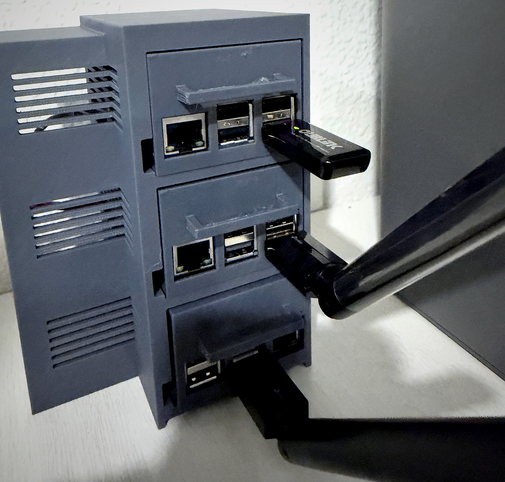
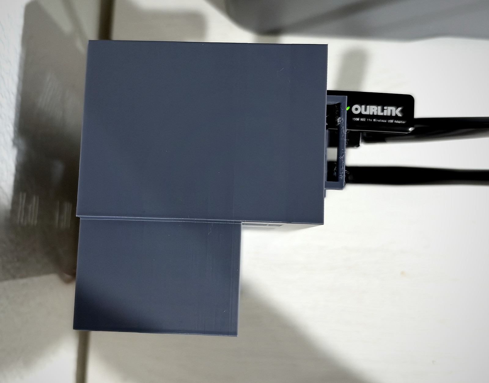

# pi-pair

Access and use the Platform: https://seller-hotels-stay-role.trycloudflare.com/

Chat for a three-board Raspberry Pi rack. Stdlib Python on the boards, no pip. The page is served on 18080.

pi2, pi3, and pi4 all sit in one custom 3D-printed server rack. Tailscale names are rpi-pi2, rpi-pi3, and rpi-pi4.






## Boards

| Board | Role | Runs |
| --- | --- | --- |
| pi4 | brain | Flash `qwen3:0.6b` and Pro `qwen3:1.7b`. The only board that decodes. |
| pi3 | dataset | OCR, documents, charts, memory, compaction, Arctic xs embed. No decode. |
| pi2 | health | Web search and image cards. No decode. |

## Layout

```
pi-pair/pair/core        config, errors, runtime, timing
pi-pair/pair/mesh        peers, health, offload, guard
pi-pair/pair/model       modes, knobs, chat, preload, sched
pi-pair/pair/turn        shape, assist, moderate, abilities
pi-pair/pair/memory      store, compact, ledger
pi-pair/pair/search      web lookup
pi-pair/pair/ingest      upload, OCR, documents
pi-pair/pair/render      charts, images, documents
pi-pair/pair/flywheel    canned map, queue, train cycle
pi-pair/pair/routes      HTTP route mixins
pi-pair/pair/nodes       worker, embedder, web search, memory store
pi-pair/pair/server.py   front server
pi-pair/web              page source; npm run build writes pi-pair/static
pi-pair/tests            unittest, mirrors pair/
pi-pair/scripts          operator commands (bench/, qa/, data/, eval/, lifecycle/, train/)
pi-pair/docs             how the rack is built and run
docs/rack                photos of the rack
```

`peers.json` is gitignored. `install.sh` creates it from `peers.example.json` only when the board does not already have one.

## Install on a board

```bash
bash pi-pair/install.sh
```

Then run the `systemctl --user` lines it prints. The installer copies the whole `pair/` package, so a module that moved cannot linger on the board as a stale file.

## Develop

```bash
make check
git config core.hooksPath .githooks
```

`make check` runs ruff, the page typecheck, shellcheck, the Python tests, the page tests, and a rebuild check of `pi-pair/static`.

## Docs

- [Architecture](pi-pair/docs/ARCHITECTURE.md) — boards, mesh, the page, and what a miss does
- [API](pi-pair/docs/API.md) — endpoints, the keyed API, agents, environment
- [Operations](pi-pair/docs/OPERATIONS.md) — start, install, failures
- [Deploy](pi-pair/docs/DEPLOY.md) — CI and the pi3 sync
- [Train](pi-pair/docs/TRAIN.md) — train, then delete
- [Datasets](pi-pair/docs/DATASETS.md)
- [Embed](pi-pair/docs/EMBED.md)
- [Images](pi-pair/docs/IMAGES.md)
- [Sources](pi-pair/docs/SOURCES.md)
