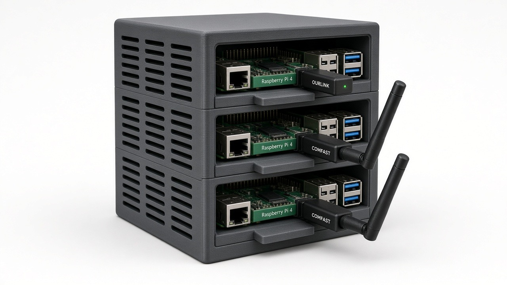
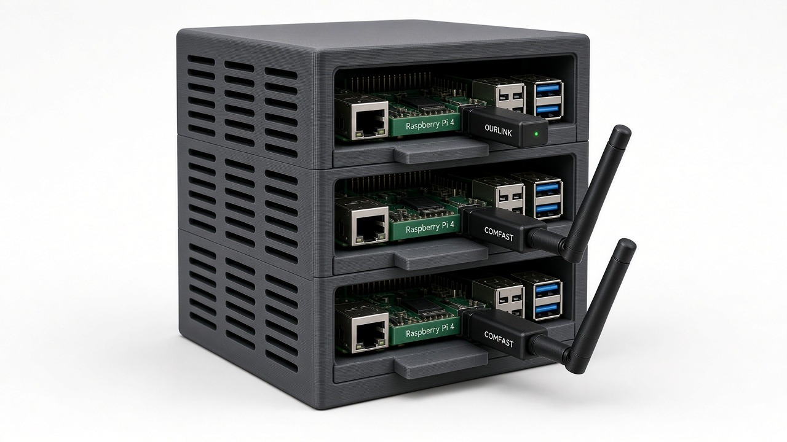
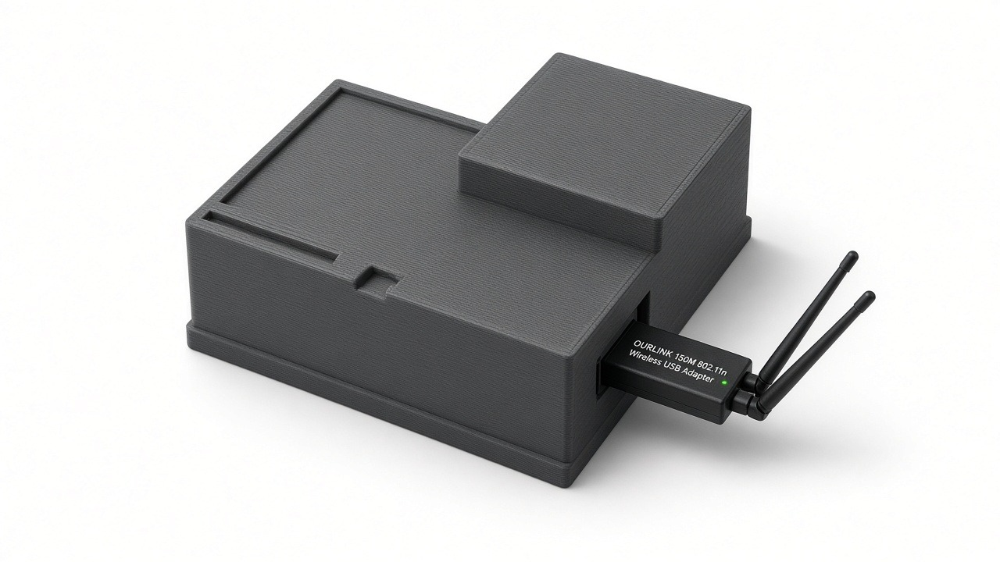

# pi-pair

Chat for the pi2, pi3, and pi4 fleet. Stdlib Python only (no pip). It proxies OpenAI-style chat to Ollama or llama.cpp. Listens on **18080**.

## Hardware

pi2, pi3, and pi4 all sit in one custom 3D-printed server rack. Tailscale names are rpi-pi2, rpi-pi3, and rpi-pi4.







## Layout

```
pi-pair/
  mini_chat.py          start here
  start.sh              same command
  pair/                 peers, health, chat, stream, HTTP
  static/               chat HTML, CSS, JS
  peers.example.json    fleet map (copy to peers.json)
  install.sh            copy to ~/pi-pair and write a user systemd unit
  mesh-hello.sh         curl /health, probe peers, send one chat
  test_pair.py          stdlib unittest
  docs/rack/            photos of the 3D-printed rack
```

`peers.json` is gitignored. `install.sh` creates it from the example only when the Pi does not already have one.

## Start

From a checkout, or from `~/pi-pair` after install:

```bash
cd pi-pair
python3 mini_chat.py
```

`bash start.sh` is the same command. Default bind is `0.0.0.0:18080`.

Smoke without a model process (peers show down; that is fine):

```bash
python3 mini_chat.py
# another shell
curl -sS http://127.0.0.1:18080/health
```

With the fleet up:

```bash
bash mesh-hello.sh
```

## Install on a Pi

```bash
rsync -av pi-pair/ pi3:~/pi-pair/
ssh pi3
cd ~/pi-pair
bash install.sh
# edit LAN hosts if needed, then:
systemctl --user daemon-reload
systemctl --user enable --now pi-pair.service
```

The example fleet is the map the chat was using:

| Name | Host | Port | Kind |
| --- | --- | --- | --- |
| pi2 | 10.0.0.180 | 8080 | llama.cpp (`/v1/models`, `/v1/chat/completions`) |
| pi3 | 10.0.0.228 | 11434 | Ollama (`/api/tags`, `/api/chat`) |
| pi4 | 10.0.0.166 | 11434 | Ollama |

pi2 is also probed on 11434 if 8080 does not answer. A pinned peer that is down returns `pi3 offline` (or that peer's name). Auto does not fall through to a different Pi when you pin one.

`install.sh` is a one-shot copy you run by hand. It does not change the `:18080` listen port.

## Endpoints

| Method | Path | Notes |
| --- | --- | --- |
| GET | `/` | Chat UI (`static/`) |
| GET | `/health`, `/peers` | Router plus peer health |
| POST | `/v1/chat/completions` | OpenAI chat. `stream:true` is SSE |

Target a peer with these headers:

```http
POST /v1/chat/completions
X-Pi-Target: auto | pi2 | pi3 | pi4
X-Pi-Mesh: on | off
```

JSON fields `pi_target` and `pi_mesh` are accepted and stripped before the worker sees the body.

## Environment

| Var | Default | Meaning |
| --- | --- | --- |
| `PI_PAIR_HOST` | `0.0.0.0` | Bind address |
| `PI_PAIR_PORT` | `18080` | UI and proxy |
| `PI_PAIR_PEERS` | `./peers.json` if it exists, else the built-in fleet | Peer list |
| `MESH_MODEL` | `qwen2.5:0.5b` | Model name when the request omits one |
| `PI_PAIR_SLOTS` | `3` | Concurrent inference cap |
| `PI_PAIR_HEALTH_TTL` | `2.5` | Seconds to cache `/health` probes |
| `PI_PAIR_NAME` | hostname | Written into the user unit by `install.sh` |
