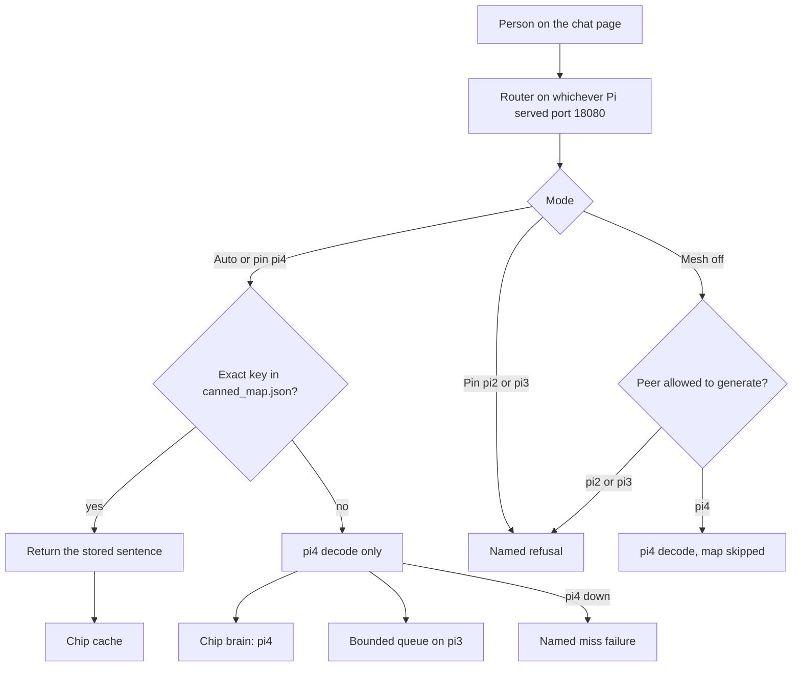

# Architecture

Chat router for the pi2, pi3, and pi4 fleet. Stdlib Python only (no pip). It listens on **18080**. A known line is answered from the canned map when the text matches a key, including the same line with different case or trailing punctuation. Anything the map does not contain is generated on pi4 and only on pi4.

The local model is small. Search and the canned map are how it answers facts it does not know.

This tree is the software half of that loop. [PR #23](https://github.com/akashnaren/raspberry-pi-fun/pull/23) merged on 2026-10-02 (`45050ee`). After that deploy of main, live end-to-end stages 1–5 on the boards were GREEN. Product Ship was YES the same day, about 13:40 PT. The prove packet for that run is the post-#23 board record at `45050ee` (fleet handoff; not a file in this tree). Hugging Face holds datasets only so far; this document does not claim published model weights.


## What local inference means here

A reply is local when the tokens, or the stored sentence that stands in for them, are produced on this rack. The phone opens a page on a Pi. The router on that Pi decides. Either it reads a sentence that was already written down, or it asks pi4 to run one forward pass of a small language model and stream the tokens back. The phone does not call a hosted chat API for this path, and a miss is not an excuse to borrow a model from a weaker board.

The mesh exists because the three boards are not interchangeable computers that happen to share a switch. One of them can decode. One of them can hold the growing map and the short-lived training files. One of them can stay up, answer a health probe, run web search, and keep a read-only copy of the map. The router is the piece that makes that split visible on every turn: Auto, a pin, or a direct call, each with a different rule, each reported on the answer as a chip.

Working memory and the dataset are different things, and mixing them up is how a small fleet fills its SD cards and then lies about what it knows. Working memory is the weights, the activations, and the key/value cache for the turn that is being decoded right now. It lives in RAM on pi4 and disappears when that turn ends, apart from whatever `keep_alive` has left resident. The dataset is the canned map: a compact `input → answer` table. It is durable, it is small, and it is allowed on pi3 and, as a mirror, on pi2. An exact map hit never enters the transformer. A line that is not that key, even a close paraphrase, is a miss. A cache miss never becomes an excuse to treat pi2 or pi3 RAM as a second brain.

## Why the shape is pi4-only, then a map, then train and delete

The fleet inventory for this rack, recorded in 2026-10-02, is the reason the router is not a round-robin.

pi2 is about 1GB of RAM and an armv7 userland. Ollama does not support that board. Its job is health probes, web search for a pi4 miss, and, if wanted, a read-only mirror of the canned map. pi2 does not decode and it does not generate.

pi3 is about 1GB of RAM and arm64. A 0.5B model can be loaded there. Generation is not reliable: short prompts come back as non-answers. pi3 keeps the dataset, the bounded miss queue, the prepared files, and the train-then-delete job. It does not emit chat tokens for a user.

pi4 is about 8GB. It is the only board in this fleet that has actually produced usable generative replies. New lines go there. Flash and Pro are two tags on that one board, not a second brain. Pins that name pi2 or pi3 as the brain are rejected in the router and again in the chat client, even if a config file has been hand-edited to say otherwise. The failure is named. The router does not quietly ask pi3 to try.

Speed is the other half. Most repeated lines in a household or an office are not new. The canned map answers those without a decode. The first time a line is new, pi4 pays for it once. The exchange is queued on pi3. A later job may fold that pair into the map, then the raw queue file and the prepared shard are deleted. The next time the same line shows up, Auto is a map read again. Disk pressure is why the delete step is mandatory. A 1GB board that keeps every transcript will fill the card; a full card takes the map down with it. The public synthetic seeds are the starting map. Live household text stays on pi3 until the job deletes it, and it is not what gets published.

Train-then-delete is our rule. The open-source trainers cited below compact data before a run and keep stage checkpoints. They do not, as shipped, wipe the raw corpus when the run finishes. We do, because these cards are small.

## Boards, models, and what each one may hold

| Board | Inventory | May hold | Must not hold |
| --- | --- | --- | --- |
| pi2 | ~1GB, armv7, Ollama unsupported | Health probes; `POST /v1/search`; read-only copy of `canned_map.json` | Chat weights, a train queue, generated tokens, decode |
| pi3 | ~1GB, arm64; 0.5B can load and still gibberish | Canned map, seed files, bounded queue, prepared shards, adapter manifests, the train job, hashed public votes | User-facing generation, decode, web search |
| pi4 | ~8GB, the only proven generative board | Quantized chat weights in Ollama; the decode for a miss; an active adapter manifest after the gate | Raw train shards, the train corpus, a second full fine-tune beside live decode, the Hugging Face upload |

pi3 keeps `snowflake-arctic-embed:xs` on loopback for the train fold and unloads it before OCR. pi4 and pi2 never hold an embed model.

The model on pi4 starts as Flash, `qwen3:0.6b`. Pro is opt-in and is `qwen3:1.7b`. A LAN request with no mode stays on Flash. `pro`, header `X-Pi-Mode: pro`, or the model string `qwen3:1.7b` selects Pro. Explicit `flash` wins over a Pro model string. The page shows Thinking until the first token, which covers the model load and a slow first word. Flash is not unloaded to make room for Pro. Both tags stay resident: startup warms Flash and Pro, every Ollama request sends `keep_alive` -1, and a tag that drops out of memory is warmed again. `install.sh` does not pull Pro. Pro stays on disk for measurement, and a chat request never runs `ollama pull`. If the tag is missing the router fails closed and names `ollama pull qwen3:1.7b` for an operator on pi4. The keyed API (`POST /api/chat`) is separate: its `mode` is still `flash`, `low`, `medium`, or `high`, and every one of those stays on the Flash checkpoint. The published config for Qwen3-0.6B (`model_type` qwen3) is 28 layers, hidden size 1024, intermediate size 3072, 16 query heads and 8 key/value heads, vocabulary 151936, rope theta 1,000,000, SiLU, tied embeddings, head dimension 128, and a card maximum of 40960 positions. Query and key vectors are RMS-normalized before RoPE. Source: the model config published at `https://huggingface.co/Qwen/Qwen3-0.6B`. Qwen3-1.7B keeps those 28 layers, 16 query heads, and 8 key/value heads, with hidden size 2048 and intermediate size 6144 (`https://huggingface.co/Qwen/Qwen3-1.7B`). This fleet does not use that full context. Rollback is a config flip in `configs/runtime/inference_pi4.json`: copy the strings in `rollback` onto `model` and `pro_model`. The router does not read the `rollback` object. `configs/runtime/inference_pi4.json` caps `num_ctx` at 2048 so the key/value cache stays inside the 8GB board with the weights and the operating system. `OLLAMA_NUM_PARALLEL` matches `ollama_num_parallel` in that file (default 2, and the router will not go above 4). Those sequences share the loaded chat tag for that request. Flash and Pro use the same router slot gate, so a full cap returns HTTP 503 for either mode and does not park the turn. The router admits the same number of generations and returns HTTP 503 when another arrives, instead of parking it behind a process-wide wait. Ollama sizes the key/value cache as `num_ctx` times that parallel value. `keep_alive` in that same file is `-1`, so a chat or stream does not reset the model TTL. The pi4 user unit `ollama-lan.service` sets `OLLAMA_MAX_LOADED_MODELS=2` (Flash and an opted-in Pro stay resident), `OLLAMA_KEEP_ALIVE=-1`, and the same `OLLAMA_NUM_PARALLEL`. A request that reaches Ollama itself after the slots are busy can still wait inside the runner; this router does not send that request. `inference_pi4.json` also sets `num_thread` to 4 and `num_batch` to 128. Pi 4 has four Cortex-A72 cores and a 1MB shared L2. Ollama forwards `num_thread` as llama.cpp `-t` only when the request sets it, and otherwise lets the runner auto-detect (`llm/llama_server.go`). `num_batch` is the prompt-ingest batch; Ollama's default is 512, and generation still samples one token at a time, so the smaller batch is for prefill. Search notes pasted into that prompt are capped at `search_note_chars` (640). The page lists at most eight of those links. Flash attention stays off: Ollama turns it on for a supported GPU, and this board decodes on the CPU. Temperature for ordinary chat sits between 0.6 and 0.8; the page defaults to 0.7, inside that band. A move up to `llama3.2:1b` waits on a health check that the process stays resident. This document does not invent a layer count for that larger model; the card is gated and was not read here.

pi2 and pi3 do not get a pull of those chat weights. `install.sh` pulls a chat model only on the pi4 role. A pin of pi2 or pi3 returns:

`pi2 cannot be the brain. Generative inference runs only on pi4. This peer does not run a chat model.`

The same sentence is used for pi3, with the name changed. If Auto misses and pi4 does not answer, the router returns:

`pi4 unreachable on cache miss. Refusing to answer from pi2 or pi3.`

A corrupt or unreadable map is treated as a miss and follows that same rule. It is not repaired by a weak model.

## Office roles

pi4 is the only generative employee. pi3 is the dataset employee: it stores the map, accepts the bounded queue, runs the job that adapts the map and then deletes the shards, and syncs public hashed votes. pi2 is health, search, and mirror. pi2 does not decode. The chat page can run on any of the three addresses below. Generation does not follow the page. It follows the rules above.

## Mesh offload

Generation stays on pi4. Search and the public label sync stay off that board so a miss does not spend pi4 on HTML or an upload.

| Board | Does | Does not |
| --- | --- | --- |
| pi4 | Generate (Flash and Pro). Ask pi2 for search, then decode locally. | Decode on another board. Upload labels. Run the train job. |
| pi2 | Health probes and `POST /v1/search`. | Decode or train. |
| pi3 | Labels, train-then-delete, and the public Hugging Face sync. | Decode or search. |

On a miss, pi4 calls pi2 at `POST /v1/search`. pi4 uses a short connect timeout (`PI_PAIR_REMOTE_SEARCH_CONNECT_TIMEOUT`, default 0.6s, and the code will not wait more than 2s to connect) so a down pi2 cannot hold the turn. The read budget (`PI_PAIR_REMOTE_SEARCH_TIMEOUT`, default 9s) is long enough for pi2 to finish one DuckDuckGo lookup while pi4's CPU stays off that fetch. If pi2 is down, the call errors, or the body is not a search result, pi4 uses the same local lookup and still generates. `PI_PAIR_REMOTE_SEARCH=0` forces that local path. `PI_PAIR_REMOTE_SEARCH=1` is what `install.sh` writes on the brain role. Either way the model call is local.

pi3 writes `data/train/public/labels.jsonl` with HMAC-SHA256 of the prompt, the answer, and any correction, plus the vote. The key is `PI_PAIR_LABEL_PEPPER` (32 bytes, hex or raw) on pi3 only. A bare SHA-256 of the text is not written. Without that pepper, the row is not published. Raw chat is not in that file. `install.sh` creates mode-600 `hf.env` with empty `HF_TOKEN=`, `KAGGLE_API_TOKEN=`, and `PI_PAIR_LABEL_PEPPER=`. Soft mints the pepper locally later. Soft does not set `HF_TOKEN` and does not create the public dataset `akashnaren/pi-mesh-labels` until Akash approves it. An unset `HF_TOKEN` skips the upload. `KAGGLE_API_TOKEN` is an optional stub that runs only after Hugging Face returns ok. It does not upload. On pi3:

```bash
python3 scripts/data/sync_mesh_labels.py
```

`post_train` records the same hashes before it deletes the raw shard. The hash file is not a raw transcript, so train-then-delete does not remove it.

The role file is `pi-pair/configs/runtime/mesh_roles.json`. The fleet notes in `peers.example.json` match it.

## Flow from the person to the answer

The person is on the phone, on the page served at port 18080. The router is whichever Pi answered that HTTP request.

If the mode is Auto, the router normalizes the latest user turn (lowercase, collapsed whitespace, trailing punctuation removed) and looks it up in `data/canned/canned_map.json`. An exact or normalized hit returns that sentence with the chip `cache`. The chat model is not called. A miss is forwarded to pi4 and generated only there. The chip on that answer is `brain: pi4`. The prompt and the answer are appended to the bounded queue on pi3 (at most 128 rows; older rows fall off the front). If this router is itself running as the dataset role, it writes the file locally. If it is running as the brain or as health, it forwards the row to pi3 and does not keep a copy.

On a miss, pi4 asks pi2 to look the line up on DuckDuckGo and then generates on pi4. pi2 keeps a few result titles, links, and short snippets. It may read one of those pages as plain text, with a size cap and a short timeout, and it does not follow links from that page. The same limits apply when pi4 falls back locally because pi2 is down. A page read resolves the hostname and blocks the fetch when any address is private or loopback, including 10.0.0.0/8, 127.0.0.0/8, 169.254.0.0/16, and 100.64.0.0/10 (Tailscale). The socket then uses that checked address, so a later lookup cannot move it. The read stops after 32000 bytes. `POST /v1/search` rejects a body larger than 4 KB with HTTP 413. That text is added only to the prompt pi4 sees. The queue still stores the person's line and the model's answer. If the lookup fails, pi4 still answers from the local model and the page says search failed. This is not a hosted chat API and it is not a second generator. pi2 does not decode and does not generate. pi3 does not search and does not decode. A chat that arrives on pi2 or pi3 is forwarded to pi4's page, so the decode stays on pi4. pi3 stores the label row. `post_train` deletes those raw rows and does not delete the canned map.

If the mode is a pin of pi4, the same map may still answer, and a miss still goes to pi4. If the mode is a pin of pi2 or pi3, the router refuses before any map read and before any HTTP call to a model. Mesh off is the direct path: the canned map is skipped and the named peer is called, but only if that peer is allowed to generate. Direct to pi2 or pi3 is the same refusal. Direct to pi4 is pi4's Ollama, through this router, with the chip `brain: pi4`.



## Neural net: what runs, and only on a miss

An exact cache hit does not tokenize, attend, or sample. The router compares a normalized string to keys in a JSON object and returns the stored string. A line that is not that key is a miss, and the miss is the chat path below.

pi4 binds and accepts on port 18080, then a background thread loads Flash and Pro with one-token chats (`keep_alive` -1, `num_predict` 1). A missing Pro tag is skipped. That thread does not run `ollama pull`. `/health` does not report an embed preload. A plot or a plain list skips web search and stays on Flash under Auto, unless the line is code or grounded math. Search notes and long attachments are cut so the 2048-token context still has room to answer. Attachment text and search notes are fenced as data, and a role label at the start of a line is stripped. If a decode times out or comes back empty, the page gets one short sentence. A list that stops on the token cap is continued once.

A miss on pi4 runs one decoder-only transformer, the Qwen3 stack behind `qwen3:0.6b`, inside Ollama. The request asks for `num_ctx` 2048, `keep_alive` -1, and the temperature for that request. A Low, Medium, or High level replaces that temperature with the Qwen3 sample for the level. Up to `ollama_num_parallel` sequences are in flight (default 2). They share that one weight load. A further generation is refused. The layers below are the published block, walked in the order a token is produced. They are not a custom net written in this repo.

**Tokens.** The user text is byte-pair encoded into integer ids. The id sequence is what the stack sees. The 151936-way vocabulary is why the last projection is expensive relative to the width of the model, and why a tied embedding (the same matrix for ids-in and logits-out) is how this checkpoint spends that parameter budget.

**Embeddings.** Each id is a row of the token embedding, width 1024. Positions are not a second learned table added on the side. Qwen3 uses rotary position on the query and key vectors inside attention, with the published rope theta of 1,000,000. Those query and key vectors are RMS-normalized before the rotary step. The context cap of 2048 is applied by the server, below the card maximum, so the cache of past keys and values cannot grow to the card's 40960.

**A block, 28 of them.** Each layer is the same shape. RMSNorm, then grouped-query attention, then a residual add. RMSNorm again, then a SwiGLU feed-forward (SiLU on the gate projection, intermediate width 3072), then another residual add. Grouped-query attention is the part that makes an 8GB decode practical: 16 query heads share 8 key/value heads, so the cache stores eight key/value streams rather than sixteen. Inside the attention of one new token the model forms queries, keys, and values, normalizes the queries and keys, rotates them, takes the softmax over the past positions up to the cap, mixes the values, and projects back to width 1024. The feed-forward is a position-wise expansion and contraction. It does not look at other tokens. Attention is where the token sees the rest of the line.

**Logits and the next id.** After the 28th block, a final RMSNorm and the tied output projection produce one logit per vocabulary row. Temperature scales those logits. A sample (or a greedy pick, if temperature is zero) chooses the next id. That id is appended, the key/value cache already holds the previous positions, and the next step does not recompute them. The new id is detokenized into text and streamed back through this router as server-sent events. The chip on that stream is `brain: pi4`.

**What this is not.** It is not a convolutional network. A convolution ties one small kernel across a grid and is the right bias when the signal is a neighborhood: pixels, a spectrogram, a local patch of a sensor. Next-token chat is a long chain of discrete ids whose relevant context can be anywhere in the 2048-token window, not in a fixed local patch. The attention block is there specifically because a convolution would have to be stacked very deep, or dilated until it stopped looking like a local kernel, to see that far. This fleet does not run a vision encoder. An attached image or JPEG-scanned PDF is OCR'd to text on the Pi, and that text is what the prompt embeds. A picture on the page is a public image card for a visual question, and the chat model does not decode those pixels. CNNs remain the usual tool if a later sensor or camera path is added beside the chat. They are not on the path that turns a missed sentence into tokens, and they are not a substitute for pi4 when pi4 is down.

Recurrent nets and state-space models are also not the runtime here. The deployed checkpoint is the transformer above. Swapping the block type would be a different model, a different pull, and another health check. It is not a fallback for a weak board.

The key/value cache is working memory. It is not copied into the canned map. The map stores finished strings. After the turn, the queue stores the prompt and the finished answer, on pi3, until the job deletes them. Those three stores stay separate so a full disk, a restart, or a training run cannot be mistaken for the model still "remembering" the conversation in RAM.

## The page

The daily tool is the page on port 18080, on the LAN addresses in the fleet map. Tailscale names work the same way when the tailnet is up. The visible title is OpenPi — MicroAstra. The first load of a tab draws a small mark, then fades it into that title; a reload of the document may play it again, and the health poll does not. The page is one column: messages, a composer fixed at the bottom, a model menu, and a Low / Medium / High control beside that composer. The model menu defaults to Auto. Auto sends the line to Flash for short chitchat, a plot, or a plain list, and to Pro when the line is long, mathematical, code, multi-step, or a web search. Flash is `qwen3:0.6b`. Pro is `qwen3:1.7b` when pi4 has that tag, and otherwise Auto stays on Flash. Choosing Flash or Pro in the menu overrides Auto. A request with no mode stays on Flash. The action row under a reply has thumbs up, thumbs down, Correct, Copy, and Retry. The turn says Thinking until the first word, covering the model load and a slow first token. Flash stays loaded. A canned hit is marked as a map and does not load a chat model. Thinking defaults to Medium and stays separate from that menu. Low and Medium are direct answers: `think` false, temperature 0.7, top_p 0.8, top_k 20. Low allows 64 answer tokens. Medium allows 384. High sets `think` true at temperature 0.6, top_p 0.95, top_k 20, and stops that channel at 192 tokens or 25 seconds, whichever comes first. `num_predict` on that first call is the 192-token cap plus a 768-token answer, because Ollama counts thinking and the answer together. If the cap is hit before the answer starts, the router sends the partial thought once and asks for a direct answer with `think` false and the 768-token budget, so the reply is not empty. Auto keeps High on Flash (`qwen3:0.6b`). High uses Pro only when Pro was chosen. The page shows a collapsed Thought for Ns panel only when reasoning actually arrived, and streams it while it is still running. The answer text and the saved history do not include the reasoning. The reply is marked with the level that was used. All three still go through Auto. The page does not say which board answered. That stays on the response headers. The gear opens settings: Dark or Light (Dark is the Temporal default, stored in the browser), the same Auto / Flash / Pro default, thinking, the voice end-of-utterance silence (1200 ms), Enter to send, and a confirmed clear. An empty composer shows a blue voice button; typing turns that same button into send.

While a reply is still running, the page shows the stages the server actually entered, in order, as server-sent `pi_status` events: thinking, then searching when a lookup runs, then answering as tokens arrive. A stored sentence skips thinking and searching and comes back as answering. A direct call that does not look anything up skips searching. The labels are Thinking, Searching or Searched, Search failed, and the reply itself. Nothing on the page is a timer pretending those stages happened.

Voice is the browser's own speech recognition and speech synthesis (Chrome's webkit speech APIs). Speak a line and the reply is read back. There is no paid speech service and no second model loaded beside the generator.

The paperclip attaches one file. The page posts it to `POST /v1/attachments` on this Pi. A `.txt` or `.md` file is decoded as text. A JPEG, PNG, GIF, WebP, TIFF, or BMP, and a PDF whose pages are JPEG scans, is read with local OCR and then uses that same text. The extracted text stays on the composer and is sent with the next line on `/v1/chat/completions`. The router fences that text as data before the model sees it, including a short OCR line that opens with a role label, so pi4 embeds the file as part of the prompt and not as a system turn. OCR is the `tesseract` binary on the Pi. A scanned PDF is rasterized with `pdftoppm` first. Each of those runs is limited to 20 seconds, and the process group is killed if it expires. At most 2 OCR jobs run at once; the next upload gets `OCR is busy`. There is no cloud OCR API.

The composer keeps the whole session. Each new line is sent with the earlier turns, and a follow-up is not answered from the canned map. Enter sends the line. Shift+Enter, or Ctrl+Enter, inserts a newline. Stop ends the reply that is still arriving. Regenerate asks the same line again. Edit changes an earlier line and sends from there, dropping the turns after it. Copy is on each message.

When the map misses, the reply shows a sources pill: up to three favicons and the exact count. The pill opens a side panel with the thinking step, the search count, and each source link the router kept, at most eight. If the lookup fails, the note says search failed and the answer is still from the local model.

Under a finished answer there is a thumbs up, a thumbs down, and Correct. Correct is an optional replacement sentence. Those controls call `POST /v1/flywheel/feedback`.

| Who | Page | Model port |
| --- | --- | --- |
| pi4 | http://10.0.0.166:18080/ and http://rpi-pi4:18080/ | http://10.0.0.166:11434/ Ollama, not the page |
| pi3 | http://10.0.0.228:18080/ and http://rpi-pi3:18080/ | none for chat |
| pi2 | http://10.0.0.180:18080/ and http://rpi-pi2:18080/ | none for chat |

There is no separate control plane. A pin of pi2 or pi3 is still refused by the router; the page itself does not offer that pin.

