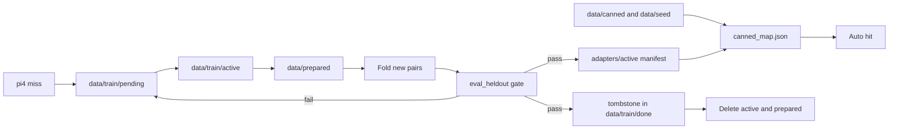

# Train then delete

Run this on pi3 (`PI_PAIR_ROLE=dataset`). pi4 and pi2 refuse the job.

```bash
python3 scripts/data/prepare_queue.py
python3 scripts/eval/run_gate.py
python3 scripts/lifecycle/post_train.py
```

`prepare_queue.py` only checks the registry and prints counts. `run_gate.py` checks the live map against the held-out file and does not edit it. `post_train.py` moves `data/train/pending/queue.jsonl` to `data/train/active/`, writes `data/prepared/<id>.jsonl`, folds new pairs into the canned map, promotes `adapters/active/manifest.json`, deletes the shard and the prepared file, and writes a tombstone in `data/train/done/` with no prompt text. A queued row may also carry `vote` (`up` or `down`) and `correction`. A down vote with no correction is not folded. A correction replaces the stored sentence for that line.

`scripts/lifecycle/delete_shards.py` removes leftovers in `data/train/active` and `data/prepared`. It leaves `data/train/pending` alone.

`scripts/train/run_sft.py` calls the same cycle as `post_train.py`. A fold that kept the raw shard would violate the disk rule, so the script does not offer that split.

The YAML file `configs/train/sft_canned.yaml` must name datasets that exist in `dataset_info.json`. An unknown name aborts before the queue moves.

The manifest records `weights: pi4-ollama`. No weight file is written here. The Ollama model stays on pi4.

Before the raw shard is deleted, voted rows are written to `data/train/public/labels.jsonl` as HMAC-SHA256 under `PI_PAIR_LABEL_PEPPER`. Without that pepper the vote is not copied into the public file. `python3 scripts/data/sync_mesh_labels.py` uploads only when `HF_TOKEN` is set. Leave `HF_TOKEN` unset until Akash approves a public dataset. The token and the pepper are not stored in git. pi4 does not run this script.

## The closed cycle

The loop is meant to be run, not only drawn.

1. **Pre-train seed.** The synthetic canned map, the SFT and preference seeds, and the held-out eval file are already in `data/`. They are the same rows published as the three dataset repos named below. No live transcript is in them.
2. **Weights on pi4.** `install.sh` on the pi4 role pulls Flash, `qwen3:0.6b`, removes `snowflake-arctic-embed:m` if that tag is still on disk, and sets `OLLAMA_NUM_PARALLEL` from `configs/runtime/inference_pi4.json` (default 2), `OLLAMA_MAX_QUEUE` to that same value, `OLLAMA_MAX_LOADED_MODELS=2`, and `OLLAMA_KEEP_ALIVE=-1`. A chat switch does not unload Flash. The installer does not pull Pro (`qwen3:1.7b`). pi2 skips the pull. pi3 keeps `snowflake-arctic-embed:xs` on loopback for the train fold and unloads it before OCR. pi4 and pi2 never hold an embed model.
3. **Chat on port 18080.** People and agents use the page. Auto hits do not decode. Misses decode on pi4.
4. **Collect.** Each successful generative completion is one row in `data/train/pending/queue.jsonl` on pi3. Hits increment a counter in `data/metrics.json` and are not stored as text. There is no unbounded chat archive. A thumbs vote, and a corrected sentence when someone writes one, is written onto that same row.
5. **Analyze.** The held-out file is the gate, not a sample of the queue. A queued line whose normalized text is a held-out input is dropped, not folded.
6. **Post-train.** On pi3, `python3 scripts/lifecycle/post_train.py` checks `dataset_info.json` first. Every name in `configs/train/sft_canned.yaml` must be registered and the file must exist, or the job stops before it touches the queue. It then moves the queue into `data/train/active/`, writes a normalized copy under `data/prepared/`, and folds accepted new pairs into a candidate map. Existing keys are left alone unless the row has a `correction`, which replaces the stored sentence. A `vote` of `down` with no correction is not folded. An up vote, or a row with no vote, still folds only new keys. This step does not run a gradient update and does not pretend to. A full LoRA or SFT trainer is the shape of the YAML and the registry; the job that actually runs on this 1GB board updates the canned map, which is the artifact the router serves. The adapter manifest records that the weights remain the Ollama model on pi4.
7. **Gate.** Held-out inputs must be absent from the candidate. Keys that were already in the map must still be there. A failed gate puts the queue back and does not promote.
8. **Promote.** The manifest moves to `adapters/active/manifest.json`. The candidate replaces `data/canned/canned_map.json`. Nothing in `adapters/` is a weight file.
9. **Delete.** The active shard and the prepared file are removed. `data/train/done/<id>.json` is a tombstone: counts and a hash of the map, no prompt and no answer. `scripts/lifecycle/delete_shards.py` can sweep leftovers in `data/train/active` and `data/prepared`. It does not delete `data/train/pending`, so a new queue is safe. It does not delete `data/canned/canned_map.json`.
10. **Repeat.** The next Auto turn can hit the line that was just folded.

Deleting the queue does not make the model larger or smaller. The served weights stay the Ollama model on pi4. This job folds accepted pairs into the canned map. A full fine-tune is not what this 1GB board runs. This is still stock Qwen3 0.6B. The canned map is not a custom model. It becomes a fine-tune of that open-source model only when a run updates weights, which this board does not do.

You can tell the cycle worked. The queue row on pi3 had the prompt, the answer, and the vote. `post_train` added a key, or the tombstone recorded the label count. The active shard and the prepared file are gone. A tombstone is under `data/train/done`. Asking that line again is a map hit.

When the card is at least 85% full, or the pending queue files pass 1MB, the oldest raw queue rows are deleted. That frees the label text. It does not delete the canned map and it does not change the weights on pi4.

pi2 may receive a copy of `canned_map.json` and must not run the job. The role check refuses `post_train` unless the process is the dataset role. pi4 must not receive the queue files or the prepared shards. Forwarding is how a page served on pi4 still feeds pi3 without leaving the text on the brain.



Weekday improvement goes through this page, not through a side channel. The standing routine named `pi-flywheel-improve` is owned by the CTO. The operator path is the one above: open the page, work in Auto, and on pi3 run `post_train` when the queue should be folded. This document does not schedule that routine.

## How the open-source trainers shaped the directories

The layout is a small reading of eight codebases, applied to a three-board rack rather than copied as a cluster stack. Train-then-delete is ours; the directory habits are theirs.

| Source | What we kept |
| --- | --- |
| [Axolotl](https://github.com/axolotl-ai-cloud/axolotl) | One config file owns a run. `configs/train/sft_canned.yaml` names the datasets and the eval set. The job refuses to start if a name is not in the registry. |
| [AllenAI Open-Instruct](https://github.com/allenai/open-instruct) | Stages are artifacts. Eval sits beside train and is not mixed into the queue. A gate runs before promote. |
| [LLaMA-Factory](https://github.com/hiyouga/LLaMA-Factory) | `dataset_info.json` is the schema registry. Columns and `stage` are explicit. Unregistered JSON is not a dataset. |
| [Hugging Face TRL](https://github.com/huggingface/trl) | One command per method. Here the command is `python3 scripts/lifecycle/post_train.py`. Preference columns are registered for a later trainer; this job does not run DPO. |
| [LitGPT](https://github.com/Lightning-AI/litgpt) | Verbs stay separate from the chat server. The train entry is a script. The router does not contain the fold. |
| [nanoGPT](https://github.com/karpathy/nanoGPT) | Prepare is a step that emits an artifact. Training reads that artifact. We delete it afterwards; nanoGPT keeps `train.bin`, and we cannot afford to. |
| [TinyLlama](https://github.com/jzhang38/TinyLlama) | Pretrain text and chat SFT are different trees (`data/seed/sft_seed` versus the canned map). The edge runtime is a quantized model on the strong board, not a second copy of the corpus. |
| [Unsloth](https://github.com/unslothai/unsloth) | Adapters, not a full fine-tune, are the intended weight update on a small machine. This repo stores the manifest and leaves the GGUF or Ollama weights on pi4. It does not merge a LoRA into a quantized base; that warning from LLaMA-Factory's export notes is why the manifest points at the base model instead of shipping a merged file we did not build. |

DeepSpeed, FSDP, and multi-node launchers from those repos are not imported. They are for a cluster this rack is not. `pi-pair/docs/SOURCES.md` repeats the URLs.

